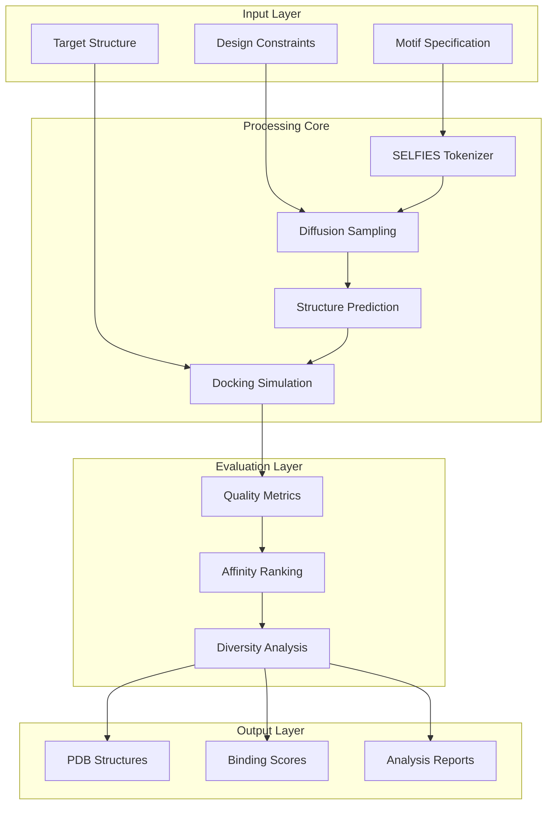

# Architecture Overview

## System Design

**protein-diffusion-design-lab** implements a modern, scalable architecture for protein scaffold generation using diffusion models. The system follows a modular design with clear separation of concerns across data processing, model inference, and evaluation pipelines.

## Core Components

### 1. Diffusion Engine (`src/protein_diffusion/models/`)
- **Primary Model**: 1B parameter transformer with rotary positional embeddings
- **Sampling Strategy**: DDPM with classifier-free guidance
- **Memory Optimization**: Gradient checkpointing and mixed precision training
- **Inference Modes**: Batch processing and streaming generation

### 2. Molecular Representation (`src/protein_diffusion/tokenization/`)
- **SELFIES Tokenizer**: Grammar-constrained molecular representation
- **Sequence Embeddings**: Learned protein sequence embeddings with ESM-2 backbone
- **Structure Encoding**: 3D coordinate tokenization using geometric hashing
- **Validation**: Real-time molecular validity checking

### 3. Structure Prediction Pipeline (`src/protein_diffusion/folding/`)
- **Primary Method**: ESMFold integration for fast structure prediction
- **Fallback**: ColabFold server integration for high-accuracy folding
- **Confidence Scoring**: pLDDT-based quality assessment
- **Post-processing**: Structure refinement and energy minimization

### 4. Docking & Evaluation (`src/protein_diffusion/evaluation/`)
- **Docking Engine**: AutoDock Vina with parallelized screening
- **Affinity Prediction**: ML-based binding affinity estimation
- **Structural Metrics**: FoldSeek-based structural similarity scoring
- **Quality Control**: Automated filtering of invalid structures

## Data Flow Architecture



## Component Interactions

### Model Serving Pipeline
1. **Request Processing**: Input validation and preprocessing
2. **Batch Formation**: Dynamic batching for optimal GPU utilization
3. **Model Inference**: Distributed inference across available GPUs
4. **Post-processing**: Structure refinement and quality filtering
5. **Result Aggregation**: Ranking and metadata attachment

### Training Infrastructure
- **Data Pipeline**: Streaming data loader with protein structure preprocessing
- **Distributed Training**: Multi-GPU training with gradient synchronization
- **Checkpointing**: Automatic model checkpointing with resumable training
- **Monitoring**: Real-time training metrics and loss visualization

## Scalability Considerations

### Horizontal Scaling
- **Model Serving**: Kubernetes-based auto-scaling for inference workloads
- **Data Processing**: Apache Spark integration for large-scale dataset processing
- **Storage**: Distributed storage with automatic replication for model weights

### Performance Optimization
- **Memory Management**: Efficient tensor management with automatic garbage collection
- **Compute Optimization**: CUDA kernel optimization for custom operations
- **I/O Optimization**: Asynchronous data loading with prefetching

## Security Architecture

### Model Protection
- **Weight Encryption**: At-rest encryption for proprietary model weights
- **API Authentication**: JWT-based authentication with role-based access
- **Rate Limiting**: Per-user and per-endpoint rate limiting

### Data Privacy
- **Input Sanitization**: Automatic removal of sensitive information from inputs
- **Audit Logging**: Comprehensive logging of all model interactions
- **Data Retention**: Configurable data retention policies

## Deployment Architecture

### Container Strategy
```
┌─────────────────┐
│   Load Balancer │
└─────────┬───────┘
          │
    ┌─────▼─────┐
    │  API      │
    │  Gateway  │
    └─────┬─────┘
          │
┌─────────▼─────────┐
│  Inference        │
│  Service          │
│  (Auto-scaling)   │
└─────────┬─────────┘
          │
┌─────────▼─────────┐
│  GPU Compute      │
│  Pool             │
└───────────────────┘
```

### Resource Requirements
- **Development**: 16GB RAM, CUDA-capable GPU (8GB+ VRAM)
- **Production**: Multi-GPU cluster with 32GB+ VRAM per node
- **Storage**: 100GB+ for model weights and temporary processing files

## Technology Stack

### Core Dependencies
- **Deep Learning**: PyTorch 2.0+ with CUDA 11.8+
- **Molecular Biology**: BioPython, MDAnalysis, OpenMM
- **Scientific Computing**: NumPy, SciPy, Pandas
- **Structure Analysis**: FoldSeek, TM-align, PyMOL

### Infrastructure
- **Containerization**: Docker with multi-stage builds
- **Orchestration**: Kubernetes with Helm charts
- **Monitoring**: Prometheus + Grafana with custom protein-specific metrics
- **Storage**: MinIO for object storage with S3 compatibility

## Quality Assurance

### Testing Strategy
- **Unit Tests**: >90% code coverage for core algorithms
- **Integration Tests**: End-to-end pipeline validation
- **Performance Tests**: Latency and throughput benchmarking
- **Scientific Validation**: Comparison with experimental binding data

### Monitoring & Observability
- **Model Performance**: Real-time inference latency and accuracy tracking
- **Resource Utilization**: GPU memory and compute utilization monitoring
- **Error Tracking**: Automated error detection and alerting
- **Scientific Metrics**: Protein quality metrics dashboard

This architecture enables rapid prototyping while maintaining production-grade reliability and scalability for protein design workflows.