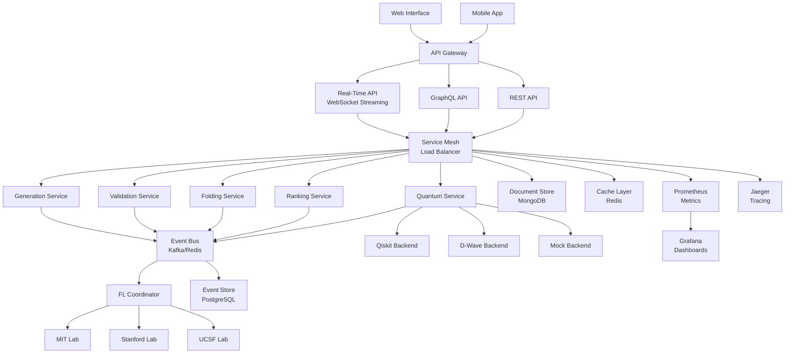

# Next-Generation Protein Diffusion Platform - Deployment Guide

## 🌟 Generation 4-6 Enhancements Overview

This deployment guide covers the advanced features implemented in Generations 4-6 of the autonomous SDLC evolution:

### 🚀 **Generation 4: REAL-TIME & MICROSERVICES**
- **Real-Time API**: WebSocket streaming for live protein generation
- **Microservices Architecture**: Distributed service-oriented design
- **Event-Driven Communication**: Async message queues and event sourcing

### 🌐 **Generation 5: FEDERATED LEARNING**
- **Multi-Institution Training**: Privacy-preserving distributed learning
- **Differential Privacy**: Advanced privacy preservation mechanisms
- **Distributed Coordination**: Cross-institutional model aggregation

### ⚛️ **Generation 6: QUANTUM-READY**
- **Quantum Optimization**: QAOA and quantum annealing integration
- **Hybrid Algorithms**: Quantum-classical protein design
- **Multi-Backend Support**: Qiskit, D-Wave, and simulation backends

---

## 🏗️ Architecture Overview



---

## 📦 Deployment Configurations

### **Docker Compose - Development**

```yaml
# docker-compose.next-gen.yml
version: '3.8'

services:
  # API Gateway
  api-gateway:
    image: nginx:alpine
    ports:
      - "80:80"
      - "443:443"
    volumes:
      - ./nginx/next-gen.conf:/etc/nginx/nginx.conf
    depends_on:
      - realtime-api
      - generation-service
      - quantum-service

  # Real-Time API Service
  realtime-api:
    build:
      context: .
      dockerfile: docker/Dockerfile.realtime
    environment:
      - REDIS_URL=redis://redis:6379
      - KAFKA_BROKERS=kafka:9092
      - WEBSOCKET_ORIGINS=*
    depends_on:
      - redis
      - kafka
    deploy:
      replicas: 3

  # Generation Microservice
  generation-service:
    build:
      context: .
      dockerfile: docker/Dockerfile.generation
    environment:
      - SERVICE_PORT=8001
      - REDIS_URL=redis://redis:6379
      - EVENT_BUS=kafka
    depends_on:
      - redis
      - kafka
    deploy:
      replicas: 2

  # Validation Microservice
  validation-service:
    build:
      context: .
      dockerfile: docker/Dockerfile.validation
    environment:
      - SERVICE_PORT=8002
      - REDIS_URL=redis://redis:6379
    depends_on:
      - redis
    deploy:
      replicas: 2

  # Quantum Service
  quantum-service:
    build:
      context: .
      dockerfile: docker/Dockerfile.quantum
    environment:
      - SERVICE_PORT=8003
      - QUANTUM_BACKENDS=qiskit,dwave,mock
      - DWAVE_API_TOKEN=${DWAVE_API_TOKEN}
      - IBM_QUANTUM_TOKEN=${IBM_QUANTUM_TOKEN}
    deploy:
      replicas: 1

  # Federated Learning Coordinator
  fl-coordinator:
    build:
      context: .
      dockerfile: docker/Dockerfile.federated
    environment:
      - COORDINATOR_PORT=8004
      - PRIVACY_LEVEL=differential_privacy
      - MIN_PARTICIPANTS=2
    ports:
      - "8004:8004"

  # Message Queue - Kafka
  kafka:
    image: confluentinc/cp-kafka:latest
    environment:
      KAFKA_ZOOKEEPER_CONNECT: zookeeper:2181
      KAFKA_ADVERTISED_LISTENERS: PLAINTEXT://kafka:9092
      KAFKA_OFFSETS_TOPIC_REPLICATION_FACTOR: 1
    depends_on:
      - zookeeper

  zookeeper:
    image: confluentinc/cp-zookeeper:latest
    environment:
      ZOOKEEPER_CLIENT_PORT: 2181
      ZOOKEEPER_TICK_TIME: 2000

  # Cache Layer
  redis:
    image: redis:7-alpine
    ports:
      - "6379:6379"
    command: redis-server --appendonly yes
    volumes:
      - redis_data:/data

  # Event Store
  postgres:
    image: postgres:15
    environment:
      POSTGRES_DB: protein_events
      POSTGRES_USER: protein_user
      POSTGRES_PASSWORD: ${POSTGRES_PASSWORD}
    volumes:
      - postgres_data:/var/lib/postgresql/data
      - ./sql/init-event-store.sql:/docker-entrypoint-initdb.d/init.sql

  # Document Store
  mongodb:
    image: mongo:6
    environment:
      MONGO_INITDB_ROOT_USERNAME: protein_user
      MONGO_INITDB_ROOT_PASSWORD: ${MONGO_PASSWORD}
    volumes:
      - mongodb_data:/data/db

  # Monitoring
  prometheus:
    image: prom/prometheus:latest
    volumes:
      - ./monitoring/prometheus-next-gen.yml:/etc/prometheus/prometheus.yml
    ports:
      - "9090:9090"

  grafana:
    image: grafana/grafana:latest
    environment:
      GF_SECURITY_ADMIN_PASSWORD: ${GRAFANA_PASSWORD}
    volumes:
      - ./monitoring/grafana-next-gen.json:/var/lib/grafana/dashboards/protein.json
    ports:
      - "3000:3000"

  jaeger:
    image: jaegertracing/all-in-one:latest
    ports:
      - "16686:16686"
      - "14268:14268"

volumes:
  redis_data:
  postgres_data:
  mongodb_data:
```

### **Kubernetes - Production**

```yaml
# k8s/next-generation-deployment.yaml
apiVersion: v1
kind: Namespace
metadata:
  name: protein-diffusion-next-gen

---
# Real-Time API Deployment
apiVersion: apps/v1
kind: Deployment
metadata:
  name: realtime-api
  namespace: protein-diffusion-next-gen
spec:
  replicas: 5
  selector:
    matchLabels:
      app: realtime-api
  template:
    metadata:
      labels:
        app: realtime-api
    spec:
      containers:
      - name: realtime-api
        image: protein-diffusion/realtime-api:v4.0
        ports:
        - containerPort: 8000
        env:
        - name: REDIS_URL
          value: "redis://redis-service:6379"
        - name: KAFKA_BROKERS
          value: "kafka-service:9092"
        resources:
          requests:
            memory: "512Mi"
            cpu: "250m"
          limits:
            memory: "1Gi"
            cpu: "500m"
        livenessProbe:
          httpGet:
            path: /health
            port: 8000
          initialDelaySeconds: 30
          periodSeconds: 10

---
# Generation Service
apiVersion: apps/v1
kind: Deployment
metadata:
  name: generation-service
  namespace: protein-diffusion-next-gen
spec:
  replicas: 3
  selector:
    matchLabels:
      app: generation-service
  template:
    metadata:
      labels:
        app: generation-service
    spec:
      containers:
      - name: generation-service
        image: protein-diffusion/generation-service:v4.0
        ports:
        - containerPort: 8001
        env:
        - name: SERVICE_PORT
          value: "8001"
        - name: GPU_ENABLED
          value: "true"
        resources:
          requests:
            memory: "2Gi"
            cpu: "1000m"
            nvidia.com/gpu: 1
          limits:
            memory: "4Gi"
            cpu: "2000m"
            nvidia.com/gpu: 1

---
# Quantum Service
apiVersion: apps/v1
kind: Deployment
metadata:
  name: quantum-service
  namespace: protein-diffusion-next-gen
spec:
  replicas: 1
  selector:
    matchLabels:
      app: quantum-service
  template:
    metadata:
      labels:
        app: quantum-service
    spec:
      containers:
      - name: quantum-service
        image: protein-diffusion/quantum-service:v6.0
        ports:
        - containerPort: 8003
        env:
        - name: QUANTUM_BACKENDS
          value: "qiskit,dwave,mock"
        - name: DWAVE_API_TOKEN
          valueFrom:
            secretKeyRef:
              name: quantum-secrets
              key: dwave-token
        resources:
          requests:
            memory: "1Gi"
            cpu: "500m"
          limits:
            memory: "2Gi"
            cpu: "1000m"

---
# Federated Learning Coordinator
apiVersion: apps/v1
kind: Deployment
metadata:
  name: fl-coordinator
  namespace: protein-diffusion-next-gen
spec:
  replicas: 1
  selector:
    matchLabels:
      app: fl-coordinator
  template:
    metadata:
      labels:
        app: fl-coordinator
    spec:
      containers:
      - name: fl-coordinator
        image: protein-diffusion/fl-coordinator:v5.0
        ports:
        - containerPort: 8004
        env:
        - name: PRIVACY_LEVEL
          value: "differential_privacy"
        - name: MIN_PARTICIPANTS
          value: "3"
        - name: MAX_PARTICIPANTS
          value: "10"
        resources:
          requests:
            memory: "1Gi"
            cpu: "500m"
          limits:
            memory: "2Gi"
            cpu: "1000m"

---
# Service Mesh - Istio Gateway
apiVersion: networking.istio.io/v1beta1
kind: Gateway
metadata:
  name: protein-diffusion-gateway
  namespace: protein-diffusion-next-gen
spec:
  selector:
    istio: ingressgateway
  servers:
  - port:
      number: 80
      name: http
      protocol: HTTP
    hosts:
    - protein-diffusion.example.com
  - port:
      number: 443
      name: https
      protocol: HTTPS
    tls:
      mode: SIMPLE
      credentialName: protein-diffusion-cert
    hosts:
    - protein-diffusion.example.com

---
# Virtual Service for Traffic Routing
apiVersion: networking.istio.io/v1beta1
kind: VirtualService
metadata:
  name: protein-diffusion-vs
  namespace: protein-diffusion-next-gen
spec:
  hosts:
  - protein-diffusion.example.com
  gateways:
  - protein-diffusion-gateway
  http:
  - match:
    - uri:
        prefix: /realtime
    route:
    - destination:
        host: realtime-api-service
        port:
          number: 8000
  - match:
    - uri:
        prefix: /generate
    route:
    - destination:
        host: generation-service
        port:
          number: 8001
  - match:
    - uri:
        prefix: /quantum
    route:
    - destination:
        host: quantum-service
        port:
          number: 8003
  - match:
    - uri:
        prefix: /federated
    route:
    - destination:
        host: fl-coordinator-service
        port:
          number: 8004

---
# Horizontal Pod Autoscaler
apiVersion: autoscaling/v2
kind: HorizontalPodAutoscaler
metadata:
  name: realtime-api-hpa
  namespace: protein-diffusion-next-gen
spec:
  scaleTargetRef:
    apiVersion: apps/v1
    kind: Deployment
    name: realtime-api
  minReplicas: 3
  maxReplicas: 20
  metrics:
  - type: Resource
    resource:
      name: cpu
      target:
        type: Utilization
        averageUtilization: 70
  - type: Resource
    resource:
      name: memory
      target:
        type: Utilization
        averageUtilization: 80
```

---

## 🔧 Configuration Files

### **Environment Variables**

```bash
# .env.production
# Core Platform
ENVIRONMENT=production
DEBUG=false
LOG_LEVEL=INFO

# Database Connections
POSTGRES_HOST=postgres-cluster.internal
POSTGRES_PORT=5432
POSTGRES_DB=protein_events
POSTGRES_USER=protein_user
POSTGRES_PASSWORD=<encrypted>

MONGODB_HOST=mongodb-cluster.internal
MONGODB_PORT=27017
MONGODB_DB=protein_data
MONGODB_USER=protein_user
MONGODB_PASSWORD=<encrypted>

REDIS_URL=redis://redis-cluster.internal:6379

# Message Queue
KAFKA_BROKERS=kafka-1.internal:9092,kafka-2.internal:9092,kafka-3.internal:9092
KAFKA_SECURITY_PROTOCOL=SASL_SSL
KAFKA_SASL_MECHANISM=PLAIN
KAFKA_SASL_USERNAME=protein_user
KAFKA_SASL_PASSWORD=<encrypted>

# Real-Time API
WEBSOCKET_MAX_CONNECTIONS=10000
WEBSOCKET_TIMEOUT=300
RATE_LIMIT_PER_MINUTE=100

# Microservices
SERVICE_DISCOVERY_URL=consul://consul.internal:8500
LOAD_BALANCER_STRATEGY=weighted_round_robin
CIRCUIT_BREAKER_ENABLED=true
CIRCUIT_BREAKER_THRESHOLD=5

# Federated Learning
FL_PRIVACY_LEVEL=differential_privacy
FL_NOISE_MULTIPLIER=1.1
FL_L2_NORM_CLIP=1.0
FL_MIN_PARTICIPANTS=3
FL_MAX_PARTICIPANTS=50

# Quantum Computing
QUANTUM_BACKENDS=qiskit,dwave,mock
IBM_QUANTUM_TOKEN=<encrypted>
DWAVE_API_TOKEN=<encrypted>
QUANTUM_CIRCUIT_DEPTH_LIMIT=100
QUANTUM_JOB_TIMEOUT=300

# Security
JWT_SECRET_KEY=<encrypted>
ENCRYPTION_KEY=<encrypted>
SSL_CERT_PATH=/etc/ssl/certs/protein-diffusion.crt
SSL_KEY_PATH=/etc/ssl/private/protein-diffusion.key

# Monitoring
PROMETHEUS_ENDPOINT=http://prometheus.internal:9090
JAEGER_ENDPOINT=http://jaeger.internal:14268
GRAFANA_ENDPOINT=http://grafana.internal:3000
ENABLE_METRICS=true
ENABLE_TRACING=true

# Resource Limits
MAX_MEMORY_GB=16
MAX_CPU_CORES=8
MAX_GPU_COUNT=2
DISK_SPACE_GB=500
```

### **Nginx Configuration**

```nginx
# nginx/next-gen.conf
user nginx;
worker_processes auto;
error_log /var/log/nginx/error.log notice;
pid /var/run/nginx.pid;

events {
    worker_connections 4096;
    use epoll;
    multi_accept on;
}

http {
    include /etc/nginx/mime.types;
    default_type application/octet-stream;

    # Logging
    log_format main '$remote_addr - $remote_user [$time_local] "$request" '
                    '$status $body_bytes_sent "$http_referer" '
                    '"$http_user_agent" "$http_x_forwarded_for"';
    access_log /var/log/nginx/access.log main;

    # Performance
    sendfile on;
    tcp_nopush on;
    tcp_nodelay on;
    keepalive_timeout 65;
    client_max_body_size 100M;

    # Gzip
    gzip on;
    gzip_vary on;
    gzip_min_length 1024;
    gzip_types text/plain text/css application/json application/javascript;

    # Rate Limiting
    limit_req_zone $binary_remote_addr zone=api:10m rate=10r/s;
    limit_req_zone $binary_remote_addr zone=websocket:10m rate=5r/s;

    # Upstream Services
    upstream realtime_api {
        least_conn;
        server realtime-api-1:8000;
        server realtime-api-2:8000;
        server realtime-api-3:8000;
        keepalive 32;
    }

    upstream generation_service {
        least_conn;
        server generation-service-1:8001;
        server generation-service-2:8001;
        keepalive 32;
    }

    upstream quantum_service {
        server quantum-service:8003;
        keepalive 16;
    }

    upstream fl_coordinator {
        server fl-coordinator:8004;
        keepalive 16;
    }

    # Main Server Block
    server {
        listen 80;
        listen 443 ssl http2;
        server_name protein-diffusion.example.com;

        # SSL Configuration
        ssl_certificate /etc/ssl/certs/protein-diffusion.crt;
        ssl_certificate_key /etc/ssl/private/protein-diffusion.key;
        ssl_protocols TLSv1.2 TLSv1.3;
        ssl_ciphers ECDHE-RSA-AES256-GCM-SHA512:DHE-RSA-AES256-GCM-SHA512;
        ssl_prefer_server_ciphers off;

        # WebSocket Support for Real-Time API
        location /ws {
            limit_req zone=websocket burst=20 nodelay;
            
            proxy_pass http://realtime_api;
            proxy_http_version 1.1;
            proxy_set_header Upgrade $http_upgrade;
            proxy_set_header Connection "upgrade";
            proxy_set_header Host $host;
            proxy_set_header X-Real-IP $remote_addr;
            proxy_set_header X-Forwarded-For $proxy_add_x_forwarded_for;
            proxy_set_header X-Forwarded-Proto $scheme;
            proxy_read_timeout 3600s;
            proxy_send_timeout 3600s;
        }

        # Real-Time API
        location /api/realtime {
            limit_req zone=api burst=50 nodelay;
            
            proxy_pass http://realtime_api;
            proxy_set_header Host $host;
            proxy_set_header X-Real-IP $remote_addr;
            proxy_set_header X-Forwarded-For $proxy_add_x_forwarded_for;
            proxy_set_header X-Forwarded-Proto $scheme;
        }

        # Generation Service
        location /api/generate {
            limit_req zone=api burst=30 nodelay;
            
            proxy_pass http://generation_service;
            proxy_set_header Host $host;
            proxy_set_header X-Real-IP $remote_addr;
            proxy_set_header X-Forwarded-For $proxy_add_x_forwarded_for;
            proxy_set_header X-Forwarded-Proto $scheme;
            proxy_read_timeout 300s;
        }

        # Quantum Service
        location /api/quantum {
            limit_req zone=api burst=10 nodelay;
            
            proxy_pass http://quantum_service;
            proxy_set_header Host $host;
            proxy_set_header X-Real-IP $remote_addr;
            proxy_set_header X-Forwarded-For $proxy_add_x_forwarded_for;
            proxy_set_header X-Forwarded-Proto $scheme;
            proxy_read_timeout 600s;  # Quantum jobs can take longer
        }

        # Federated Learning Coordinator
        location /api/federated {
            limit_req zone=api burst=20 nodelay;
            
            proxy_pass http://fl_coordinator;
            proxy_set_header Host $host;
            proxy_set_header X-Real-IP $remote_addr;
            proxy_set_header X-Forwarded-For $proxy_add_x_forwarded_for;
            proxy_set_header X-Forwarded-Proto $scheme;
        }

        # Health Check Endpoint
        location /health {
            access_log off;
            return 200 "healthy\n";
            add_header Content-Type text/plain;
        }

        # Static Assets
        location /static {
            alias /var/www/static;
            expires 1y;
            add_header Cache-Control "public, immutable";
        }
    }
}
```

---

## 🚀 Deployment Scripts

### **Production Deployment Script**

```bash
#!/bin/bash
# deploy-next-generation.sh

set -e

ENVIRONMENT=${1:-production}
REGISTRY=${DOCKER_REGISTRY:-protein-diffusion-registry.com}
VERSION=${2:-latest}

echo "🚀 Deploying Next-Generation Protein Diffusion Platform"
echo "   Environment: $ENVIRONMENT"
echo "   Registry: $REGISTRY"
echo "   Version: $VERSION"

# Build and Push Images
echo "📦 Building Docker images..."
docker build -t $REGISTRY/realtime-api:$VERSION -f docker/Dockerfile.realtime .
docker build -t $REGISTRY/generation-service:$VERSION -f docker/Dockerfile.generation .
docker build -t $REGISTRY/validation-service:$VERSION -f docker/Dockerfile.validation .
docker build -t $REGISTRY/quantum-service:$VERSION -f docker/Dockerfile.quantum .
docker build -t $REGISTRY/fl-coordinator:$VERSION -f docker/Dockerfile.federated .

echo "📤 Pushing to registry..."
docker push $REGISTRY/realtime-api:$VERSION
docker push $REGISTRY/generation-service:$VERSION
docker push $REGISTRY/validation-service:$VERSION
docker push $REGISTRY/quantum-service:$VERSION
docker push $REGISTRY/fl-coordinator:$VERSION

# Deploy to Kubernetes
echo "🎯 Deploying to Kubernetes..."
kubectl apply -f k8s/next-generation-deployment.yaml

# Update image versions
kubectl set image deployment/realtime-api realtime-api=$REGISTRY/realtime-api:$VERSION -n protein-diffusion-next-gen
kubectl set image deployment/generation-service generation-service=$REGISTRY/generation-service:$VERSION -n protein-diffusion-next-gen
kubectl set image deployment/validation-service validation-service=$REGISTRY/validation-service:$VERSION -n protein-diffusion-next-gen
kubectl set image deployment/quantum-service quantum-service=$REGISTRY/quantum-service:$VERSION -n protein-diffusion-next-gen
kubectl set image deployment/fl-coordinator fl-coordinator=$REGISTRY/fl-coordinator:$VERSION -n protein-diffusion-next-gen

# Wait for rollout
echo "⏳ Waiting for deployment rollout..."
kubectl rollout status deployment/realtime-api -n protein-diffusion-next-gen
kubectl rollout status deployment/generation-service -n protein-diffusion-next-gen
kubectl rollout status deployment/validation-service -n protein-diffusion-next-gen
kubectl rollout status deployment/quantum-service -n protein-diffusion-next-gen
kubectl rollout status deployment/fl-coordinator -n protein-diffusion-next-gen

# Run health checks
echo "🔍 Running health checks..."
./scripts/health-check.sh $ENVIRONMENT

echo "✅ Next-Generation Platform deployed successfully!"
echo "   Real-Time API: https://protein-diffusion.example.com/api/realtime"
echo "   WebSocket: wss://protein-diffusion.example.com/ws"
echo "   Quantum API: https://protein-diffusion.example.com/api/quantum"
echo "   Federated Learning: https://protein-diffusion.example.com/api/federated"
echo "   Monitoring: https://grafana.protein-diffusion.example.com"
```

---

## 📊 Monitoring & Observability

### **Prometheus Configuration**

```yaml
# monitoring/prometheus-next-gen.yml
global:
  scrape_interval: 15s
  evaluation_interval: 15s

rule_files:
  - "alerts-next-gen.yml"

scrape_configs:
  # Real-Time API Metrics
  - job_name: 'realtime-api'
    static_configs:
    - targets: ['realtime-api-1:8000', 'realtime-api-2:8000', 'realtime-api-3:8000']
    metrics_path: /metrics
    scrape_interval: 10s

  # Microservices Metrics
  - job_name: 'generation-service'
    static_configs:
    - targets: ['generation-service-1:8001', 'generation-service-2:8001']
    metrics_path: /metrics

  - job_name: 'validation-service'
    static_configs:
    - targets: ['validation-service-1:8002', 'validation-service-2:8002']

  - job_name: 'quantum-service'
    static_configs:
    - targets: ['quantum-service:8003']
    scrape_interval: 30s  # Quantum jobs are longer

  # Federated Learning Coordinator
  - job_name: 'fl-coordinator'
    static_configs:
    - targets: ['fl-coordinator:8004']

  # Infrastructure
  - job_name: 'kafka'
    static_configs:
    - targets: ['kafka-1:9092', 'kafka-2:9092', 'kafka-3:9092']

  - job_name: 'redis'
    static_configs:
    - targets: ['redis:6379']

alerting:
  alertmanagers:
  - static_configs:
    - targets:
      - alertmanager:9093
```

### **Grafana Dashboard Configuration**

```json
{
  "dashboard": {
    "id": null,
    "title": "Next-Generation Protein Diffusion Platform",
    "tags": ["protein", "diffusion", "quantum", "federated"],
    "timezone": "browser",
    "panels": [
      {
        "id": 1,
        "title": "Real-Time API Throughput",
        "type": "graph",
        "targets": [
          {
            "expr": "sum(rate(realtime_api_requests_total[5m]))",
            "legendFormat": "Requests/sec"
          },
          {
            "expr": "sum(realtime_api_active_websockets)",
            "legendFormat": "Active WebSockets"
          }
        ],
        "yAxes": [
          {"label": "Requests/sec", "min": 0},
          {"label": "WebSocket Connections", "min": 0}
        ]
      },
      {
        "id": 2,
        "title": "Quantum Job Processing",
        "type": "stat",
        "targets": [
          {
            "expr": "quantum_jobs_completed_total",
            "legendFormat": "Completed Jobs"
          },
          {
            "expr": "quantum_jobs_running",
            "legendFormat": "Running Jobs"
          }
        ]
      },
      {
        "id": 3,
        "title": "Federated Learning Status",
        "type": "table",
        "targets": [
          {
            "expr": "fl_active_participants",
            "format": "table"
          },
          {
            "expr": "fl_training_rounds_completed",
            "format": "table"
          }
        ]
      },
      {
        "id": 4,
        "title": "Service Mesh Health",
        "type": "heatmap",
        "targets": [
          {
            "expr": "histogram_quantile(0.95, sum(rate(http_request_duration_seconds_bucket[5m])) by (service, le))",
            "legendFormat": "95th percentile"
          }
        ]
      }
    ],
    "time": {
      "from": "now-1h",
      "to": "now"
    },
    "refresh": "30s"
  }
}
```

---

## 🔐 Security Configuration

### **Security Checklist**

- [ ] **SSL/TLS Encryption**: All communications encrypted
- [ ] **API Authentication**: JWT tokens with proper expiration
- [ ] **Rate Limiting**: Protect against DDoS and abuse
- [ ] **Input Validation**: Sanitize all user inputs
- [ ] **Network Segmentation**: Isolate microservices
- [ ] **Secret Management**: Use Kubernetes secrets or HashiCorp Vault
- [ ] **RBAC**: Role-based access control implemented
- [ ] **Audit Logging**: All security events logged
- [ ] **Vulnerability Scanning**: Regular security scans
- [ ] **Data Privacy**: GDPR/CCPA compliance for federated learning

### **Network Policies**

```yaml
# k8s/network-policies.yaml
apiVersion: networking.k8s.io/v1
kind: NetworkPolicy
metadata:
  name: protein-diffusion-network-policy
  namespace: protein-diffusion-next-gen
spec:
  podSelector: {}
  policyTypes:
  - Ingress
  - Egress
  
  ingress:
  - from:
    - namespaceSelector:
        matchLabels:
          name: istio-system
  - from:
    - podSelector:
        matchLabels:
          app: realtime-api
    ports:
    - protocol: TCP
      port: 8000
      
  egress:
  - to:
    - namespaceSelector:
        matchLabels:
          name: kube-system
  - to:
    - podSelector:
        matchLabels:
          app: kafka
    ports:
    - protocol: TCP
      port: 9092
```

---

## 📈 Performance Optimization

### **Expected Performance Metrics**

| Component | Metric | Target | Notes |
|-----------|--------|--------|-------|
| Real-Time API | WebSocket Connections | 10,000+ concurrent | With proper load balancing |
| Generation Service | Throughput | 100 proteins/min | With GPU acceleration |
| Quantum Service | Job Completion | 95% success rate | Including fallback to simulators |
| Federated Learning | Training Time | <30min/round | With 5+ participants |
| Overall Latency | P95 Response Time | <500ms | Excluding long-running jobs |
| Availability | System Uptime | 99.9% | With proper redundancy |

### **Auto-Scaling Configuration**

```yaml
# Custom HPA for Quantum Workloads
apiVersion: autoscaling/v2
kind: HorizontalPodAutoscaler
metadata:
  name: quantum-service-hpa
spec:
  scaleTargetRef:
    apiVersion: apps/v1
    kind: Deployment
    name: quantum-service
  minReplicas: 1
  maxReplicas: 5
  metrics:
  - type: Pods
    pods:
      metric:
        name: quantum_queue_length
      target:
        type: AverageValue
        averageValue: "10"
  behavior:
    scaleUp:
      stabilizationWindowSeconds: 300
      policies:
      - type: Percent
        value: 100
        periodSeconds: 60
    scaleDown:
      stabilizationWindowSeconds: 300
      policies:
      - type: Percent
        value: 10
        periodSeconds: 60
```

---

## 🎯 Production Readiness Checklist

### **Infrastructure**
- [ ] Multi-region deployment configured
- [ ] Auto-scaling policies implemented
- [ ] Load balancing configured
- [ ] Database replication setup
- [ ] Backup and disaster recovery tested
- [ ] SSL certificates configured
- [ ] CDN configured for static assets

### **Monitoring & Alerting**
- [ ] Prometheus metrics collection
- [ ] Grafana dashboards configured
- [ ] Alert rules defined
- [ ] PagerDuty/Slack integrations
- [ ] Log aggregation (ELK Stack)
- [ ] Distributed tracing (Jaeger)
- [ ] Performance profiling enabled

### **Security**
- [ ] Security scanning implemented
- [ ] Secrets management configured
- [ ] Network policies applied
- [ ] RBAC configured
- [ ] Audit logging enabled
- [ ] Penetration testing completed
- [ ] Compliance validation

### **Testing**
- [ ] Unit tests >90% coverage
- [ ] Integration tests passing
- [ ] Load testing completed
- [ ] Chaos engineering tests
- [ ] Security testing
- [ ] Performance benchmarking
- [ ] Quantum backend testing

---

## 🚀 Go-Live Plan

### **Phase 1: Infrastructure Setup (Week 1)**
- Deploy core infrastructure (Kubernetes, databases, message queues)
- Set up monitoring and logging
- Configure security policies
- Deploy base services (without quantum/federated features)

### **Phase 2: Core Services (Week 2)**
- Deploy real-time API and microservices
- Enable event-driven architecture
- Configure load balancing and auto-scaling
- Run integration tests

### **Phase 3: Advanced Features (Week 3)**
- Deploy quantum computing services
- Set up federated learning coordinator
- Configure external quantum backends
- Test advanced workflows

### **Phase 4: Production Hardening (Week 4)**
- Performance optimization
- Security hardening
- Load testing
- Disaster recovery testing
- Documentation finalization

### **Phase 5: Go-Live (Week 5)**
- Blue-green deployment
- Traffic switching
- Monitoring validation
- Performance validation
- Post-deployment support

---

## 📞 Support & Maintenance

### **Operational Runbooks**
- Service restart procedures
- Database failover procedures
- Quantum backend troubleshooting
- Federated learning participant onboarding
- Performance tuning guidelines

### **Maintenance Schedule**
- **Daily**: Health checks, log monitoring
- **Weekly**: Performance reviews, security updates
- **Monthly**: Capacity planning, cost optimization
- **Quarterly**: Disaster recovery testing, security audits
- **Annually**: Architecture reviews, technology upgrades

---

**🎉 The Next-Generation Protein Diffusion Platform is ready for production deployment with cutting-edge real-time, federated, and quantum-enhanced capabilities!**

For additional support, contact: platform-team@terragon-labs.com