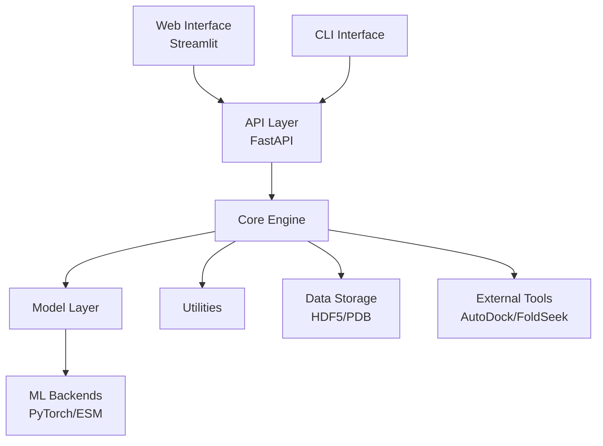
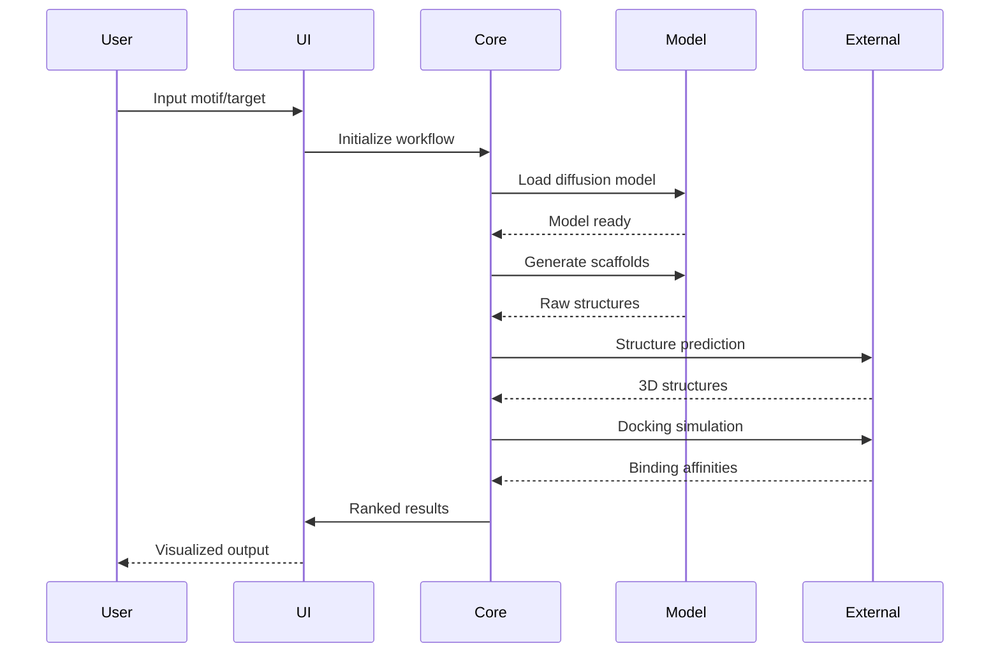

# Architecture Documentation

## System Overview

The protein-diffusion-design-lab is architected as a modular, extensible platform for protein design using diffusion models. The system follows a layered architecture with clear separation of concerns.

## High-Level Architecture



## Component Architecture

### 1. Core Engine (`src/protein_diffusion/core/`)

**Purpose**: Central orchestration of protein design workflows

**Key Components**:
- `ProteinDiffuser`: Main diffusion model interface
- `AffinityRanker`: Binding affinity prediction and ranking
- `StructurePredictor`: 3D structure prediction pipeline
- `WorkflowManager`: End-to-end pipeline orchestration

**Design Patterns**:
- Factory pattern for model instantiation
- Observer pattern for progress tracking
- Strategy pattern for different diffusion strategies

### 2. Model Layer (`src/protein_diffusion/models/`)

**Purpose**: ML model implementations and interfaces

**Key Components**:
- `DiffusionModel`: Core diffusion transformer
- `TokenizerManager`: SELFIES and amino acid tokenization
- `ESMIntegration`: ESMFold structure prediction wrapper
- `ModelCheckpoints`: Model weight management

**Design Principles**:
- Model-agnostic interfaces
- Lazy loading for memory efficiency
- GPU/CPU abstraction layer

### 3. Data Layer (`src/protein_diffusion/data/`)

**Purpose**: Data processing and I/O operations

**Key Components**:
- `ProteinStructure`: Core data class for protein representations
- `PDBParser`: PDB file parsing and validation
- `DataLoaders`: PyTorch dataset implementations
- `CacheManager`: Intelligent caching system

### 4. Utils Layer (`src/protein_diffusion/utils/`)

**Purpose**: Shared utilities and helper functions

**Key Components**:
- `ConfigManager`: Configuration handling
- `Logger`: Structured logging
- `Metrics`: Performance and quality metrics
- `Visualization`: Molecular visualization utilities

## Data Flow Architecture



## Configuration Architecture

### Environment Configuration

```yaml
# config/default.yaml
model:
  checkpoint_path: "weights/boltz-1b.ckpt"
  device: "auto"  # auto, cpu, cuda
  batch_size: 32
  temperature: 0.8

data:
  cache_dir: ".cache/protein_diffusion"
  max_sequence_length: 1000
  
external_tools:
  autodock_path: "/usr/local/bin/vina"
  foldseek_path: "/usr/local/bin/foldseek"
```

### Runtime Configuration

Configuration priority (highest to lowest):
1. Environment variables (`PROTEIN_DIFFUSION_*`)
2. CLI arguments
3. User config file (`~/.protein_diffusion/config.yaml`)
4. Project config (`config/default.yaml`)

## Scalability Architecture

### Horizontal Scaling

- **Batch Processing**: Vectorized operations for parallel scaffold generation
- **Distributed Computing**: Ray/Dask integration for multi-node processing
- **Model Parallelism**: Support for model sharding across multiple GPUs

### Vertical Scaling

- **Memory Management**: Gradient checkpointing and mixed precision training
- **Caching Strategy**: Multi-level caching (memory, disk, distributed)
- **Resource Optimization**: Dynamic batch sizing based on available resources

## Security Architecture

### Data Security

- **Input Validation**: Comprehensive validation of all inputs
- **Sanitization**: Safe handling of PDB files and molecular data
- **Access Control**: Role-based access for web interface

### Model Security

- **Checksum Validation**: Model weight integrity verification
- **Secure Downloads**: HTTPS/signed downloads for pre-trained models
- **Audit Logging**: Comprehensive logging of model usage

## Extension Points

### Plugin Architecture

```python
from protein_diffusion.plugins import PluginBase

class CustomScoringFunction(PluginBase):
    def __init__(self):
        super().__init__()
        
    def score(self, structure: ProteinStructure) -> float:
        # Custom scoring implementation
        return score
```

### Model Backends

Support for multiple diffusion backends:
- Default PyTorch implementation
- JAX/Flax implementation (planned)
- TensorFlow implementation (planned)

## Performance Architecture

### Computational Efficiency

- **JIT Compilation**: TorchScript for inference optimization
- **Memory Pooling**: Custom memory allocators for large tensors
- **Operator Fusion**: Optimized CUDA kernels for critical operations

### I/O Optimization

- **Lazy Loading**: On-demand loading of model components
- **Compression**: Efficient storage of protein structures
- **Streaming**: Support for processing large protein databases

## Quality Assurance Architecture

### Testing Strategy

- **Unit Tests**: Component-level testing with mocks
- **Integration Tests**: Multi-component workflow testing  
- **End-to-End Tests**: Full pipeline validation
- **Performance Tests**: Benchmark and regression testing

### Monitoring & Observability

- **Metrics Collection**: Prometheus-compatible metrics
- **Distributed Tracing**: OpenTelemetry integration
- **Health Checks**: Comprehensive system health monitoring

## Deployment Architecture

### Container Strategy

```dockerfile
# Multi-stage build for optimization
FROM pytorch/pytorch:2.0-cuda11.7-devel as builder
# Build dependencies...

FROM pytorch/pytorch:2.0-cuda11.7-runtime
# Runtime environment...
```

### Infrastructure

- **Development**: Local development with Docker Compose
- **Staging**: Kubernetes deployment with reduced resources
- **Production**: Auto-scaling Kubernetes cluster with GPU nodes

## Future Architecture Considerations

### Planned Enhancements

1. **Microservices**: Decomposition into specialized services
2. **Event-Driven**: Async processing with message queues
3. **ML Ops**: Automated model training and deployment pipelines
4. **Federation**: Support for federated learning across institutions

### Technology Evolution

- **Hardware**: Support for specialized AI accelerators (TPUs, FPGAs)
- **Models**: integration with emerging protein design architectures
- **Platforms**: Cloud-native deployment options (AWS, GCP, Azure)

This architecture provides a solid foundation for current requirements while maintaining flexibility for future enhancements.