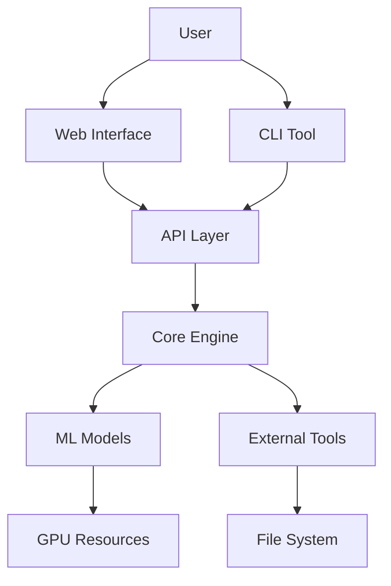

# Threat Model for Protein Diffusion Design Lab

## Overview

This document outlines the threat model for the protein-diffusion-design-lab project, identifying potential security risks and mitigation strategies.

## System Architecture

## Threat Analysis

### 1. Input Validation Threats

**Threat**: Malicious input via protein sequences, PDB files, or configuration
**Impact**: Code injection, resource exhaustion, data corruption
**Likelihood**: Medium
**Mitigation**:
- Comprehensive input validation
- Sanitization of all user inputs
- File format validation for PDB/molecular files
- Size limits on uploads and inputs

### 2. Model Security Threats

**Threat**: Malicious model weights or poisoned models
**Impact**: Compromised predictions, backdoor attacks
**Likelihood**: Medium
**Mitigation**:
- Model weight checksums and signatures
- Secure model distribution channels
- Model validation and testing
- Isolation of model execution

### 3. Dependency Supply Chain Threats

**Threat**: Compromised dependencies or malicious packages
**Impact**: Full system compromise
**Likelihood**: Medium
**Mitigation**:
- Dependency scanning and vulnerability management
- Package pinning and lock files
- Regular dependency updates
- Software Bill of Materials (SBOM) generation

### 4. Data Exfiltration Threats

**Threat**: Unauthorized access to protein designs or research data
**Impact**: Intellectual property theft
**Likelihood**: Low
**Mitigation**:
- Access controls and authentication
- Data encryption at rest and in transit
- Audit logging of data access
- Network segmentation

### 5. Resource Exhaustion Threats

**Threat**: DoS attacks via computationally expensive operations
**Impact**: Service unavailability, resource waste
**Likelihood**: High
**Mitigation**:
- Rate limiting and throttling
- Resource quotas and limits
- Request validation and filtering
- Monitoring and alerting

### 6. Container Security Threats

**Threat**: Container escape or privilege escalation
**Impact**: Host system compromise
**Likelihood**: Low
**Mitigation**:
- Non-root container execution
- Minimal container images
- Container security scanning
- Runtime security monitoring

### 7. Web Interface Threats

**Threat**: XSS, CSRF, or other web-based attacks
**Impact**: Client-side compromise, session hijacking
**Likelihood**: Medium
**Mitigation**:
- Input sanitization and output encoding
- CSRF tokens and SameSite cookies
- Content Security Policy (CSP)
- Regular security testing

### 8. Configuration Security Threats

**Threat**: Insecure default configurations or exposed secrets
**Impact**: Unauthorized access, data exposure
**Likelihood**: Medium
**Mitigation**:
- Secure defaults
- Secret management systems
- Configuration validation
- Environment separation

## Risk Assessment Matrix

| Threat Category | Likelihood | Impact | Risk Level | Priority |
|-----------------|------------|--------|------------|----------|
| Input Validation | Medium | High | High | 1 |
| Resource Exhaustion | High | Medium | High | 2 |
| Web Interface | Medium | Medium | Medium | 3 |
| Model Security | Medium | Medium | Medium | 4 |
| Supply Chain | Medium | High | Medium | 5 |
| Configuration | Medium | Medium | Medium | 6 |
| Data Exfiltration | Low | High | Medium | 7 |
| Container Security | Low | High | Medium | 8 |

## Security Controls

### Authentication & Authorization
- Multi-factor authentication support
- Role-based access control (RBAC)
- Session management and timeout
- API key authentication for programmatic access

### Data Protection
- Encryption at rest (AES-256)
- Encryption in transit (TLS 1.3)
- Secure key management
- Data anonymization where applicable

### Network Security
- Network segmentation
- Firewall rules and access controls
- VPN for remote access
- Intrusion detection and prevention

### Monitoring & Logging
- Comprehensive audit logging
- Real-time monitoring and alerting
- Security event correlation
- Log integrity protection

### Secure Development
- Security code reviews
- Static and dynamic analysis
- Dependency scanning
- Penetration testing

## Incident Response

### Preparation
- Incident response plan documented
- Response team identified and trained
- Communication channels established
- Recovery procedures tested

### Detection & Analysis
- Automated monitoring and alerting
- Log analysis and correlation
- Threat intelligence integration
- Forensic capabilities

### Containment & Recovery
- Isolation procedures
- Evidence preservation
- System restoration
- Business continuity plans

### Post-Incident
- Lessons learned documentation
- Process improvements
- Security control updates
- Stakeholder communication

## Compliance Considerations

### Data Privacy
- GDPR compliance for EU users
- Privacy by design principles
- Data retention policies
- User consent management

### Research Ethics
- Responsible AI practices
- Bias detection and mitigation
- Transparency in model behavior
- Ethical use guidelines

### Industry Standards
- NIST Cybersecurity Framework alignment
- ISO 27001 security management
- OWASP secure coding practices
- Cloud security best practices

## Threat Model Updates

This threat model will be reviewed and updated:
- Quarterly or after significant architecture changes
- Following security incidents
- When new threat intelligence emerges
- As part of major version releases

## Security Testing

### Automated Testing
- SAST (Static Application Security Testing)
- DAST (Dynamic Application Security Testing)
- Container vulnerability scanning
- Dependency vulnerability scanning

### Manual Testing
- Penetration testing (annual)
- Code security reviews
- Architecture security reviews
- Red team exercises

## Security Metrics

### Key Performance Indicators
- Mean time to detect (MTTD) security issues
- Mean time to resolve (MTTR) vulnerabilities
- Percentage of high-risk vulnerabilities remediated within SLA
- Security training completion rates

### Vulnerability Management
- Critical vulnerabilities: 24 hours
- High vulnerabilities: 7 days
- Medium vulnerabilities: 30 days
- Low vulnerabilities: 90 days

This threat model serves as a living document to guide security decisions and investments for the protein-diffusion-design-lab project.